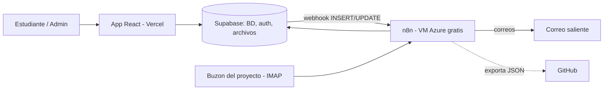
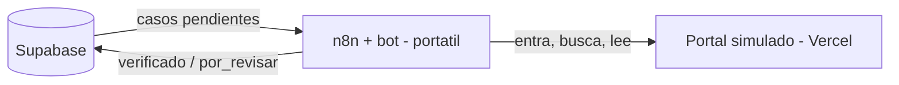

# Sistema Inteligente de Gestión de Solicitudes Universitarias
## Resumen del proyecto y plan de ejecución (MVP)

Equipo: José Díaz · Edwin Vélez · Miguel Moreno · Abel García · Santiago Martínez
Curso: Sistemas Empresariales — UPB
Fecha del plan: 17/09/2026 · Versión 2 (MVP hasta Tarea 1)

---

## 1. Qué estamos construyendo

**Problema.** Los trámites académicos de excepción (homologaciones, cancelaciones extemporáneas, supletorios, reingresos, solicitudes a comités) se gestionan por correo: sin estado consultable, sin historial y sin datos para medir tiempos.

**Solución.** Una aplicación web donde:

- El estudiante inicia sesión, registra su solicitud (tipo, asunto, descripción, adjunto opcional) y consulta su avance. Mientras siga pendiente, puede retirarla.
- Un asesor toma el caso (queda como responsable), cambia su estado (`Pendiente`, `En proceso`, `Finalizada`, `Rechazada`, `Retirada`) y agrega observaciones. Un desistimiento con el caso en proceso lo registra su responsable como `Retirada`, con observación. El administrador supervisa: ve la carga de cada asesor, reasigna casos, reabre uno cerrado y da o quita el rol de asesor.
- Cada cambio queda en un historial: fecha, estado anterior, estado nuevo y responsable.
- n8n automatiza los avisos y convierte las solicitudes que llegan por correo en casos.

**Tipo de sistema empresarial.** Sistema de gestión de casos de servicio: un **CRM enfocado en servicio / atención al cliente**, donde el "cliente" es el estudiante, diseñado con enfoque **BPM** (gestión de procesos: estados, reglas, historial, indicadores).
> Límite del encuadre: no incluye ventas ni marketing; decir siempre "CRM de servicio". **Confirmar esta categoría con la profesora antes de reescribir la propuesta.**

**Encuadre de la automatización en el MVP: "automatización de procesos".**

| Pieza | Qué es realmente |
|---|---|
| Avisos (registro, cambio de estado, recordatorio) | Automatización de flujos por eventos |
| Tarea 1: correo → caso | Automatización de flujos que elimina la transcripción manual de solicitudes |

> **No llamar RPA al MVP.** RPA es un robot que opera una interfaz (pantalla) como una persona. La Tarea 1 usa conexiones directas (IMAP y la API de Supabase), no pantallas. Puede decirse que *cumple el mismo propósito* que un RPA (quitar trabajo repetitivo de transcripción), pero no que *es* RPA. El componente RPA real queda como trabajo futuro (sección 8).

Regla de diseño: **la automatización no decide**. Aprobar o rechazar siempre lo hace una persona.

### Stack

| Componente | Herramienta | Dónde vive |
|---|---|---|
| Frontend | React | Vercel |
| Base de datos, autenticación, archivos | Supabase (plan gratuito) | Supabase |
| Automatización | n8n Community Edition (gratis) | Máquina virtual gratuita en Azure |
| HTTPS del servidor | Caddy (proxy inverso con certificado automático) | Servidor de Azure |
| Versionado | Git (GitHub) | GitHub |

---

## 2. Arquitectura del MVP



Puntos obligatorios:

- n8n debe estar **encendido 24/7** (recordatorios por horario y lectura periódica del correo).
- n8n debe tener **dirección pública con HTTPS** (Supabase le envía webhooks).

---

## 3. Decisiones ya tomadas

1. Una sola instancia de n8n en un servidor, compartida por los 5.
2. Una sola cuenta dueña de n8n (la edición gratuita no permite compartir flujos entre usuarios).
   - Es un usuario que existe solo en el servidor; el correo es el nombre de usuario.
   - Contraseña exclusiva de n8n, distinta a la de cualquier correo, guardada en el gestor de contraseñas.
   - Preferible registrarla con el correo del proyecto (licencia y recuperación llegan a un buzón que todos controlan).
3. Git como bitácora: cada cambio se exporta a `.json` y se sube con el nombre del autor.
4. Un responsable por flujo; nadie edita el flujo de otro.
5. Nunca editar un flujo activo: duplicar como `[PRUEBA] ...`, probar, reemplazar.
6. **MVP = avisos + Tarea 1 (correo → caso).**
7. **El bot de navegador (Tarea 3) sale del MVP** por presupuesto: una VM con memoria suficiente para el navegador supera el saldo disponible.
8. Claude ayuda con flujos (JSON importable), código, `docker-compose`, SQL y depuración. Claude no accede al servidor: el equipo ejecuta y reporta resultados.

---

## 4. Infraestructura en Azure

### 4.1 Máquina virtual

| Tamaño | vCPU | RAM | Costo | Uso |
|---|---|---|---|---|
| **B2ats v2 (AMD)** | 2 | 1 GiB | **Gratis** con cuenta nueva o Azure for Students (750 h/mes, 12 meses) | **Opción elegida** |
| B1s | 1 | 1 GiB | Gratis (mismo beneficio) | Plan B si B2ats v2 no aparece o no hay cuota |

> - 750 h/mes cubre un mes completo encendido (un mes tiene como máximo 744 h).
> - 1 GiB alcanza para n8n sin navegador, **con swap** de 2 GB.
> - Si al crear la VM aparece "cuota insuficiente" para B2ats v2, usar B1s o pedir aumento de cuota.
> - Máquinas de pago (B1ms, B2als v2) quedaron descartadas por presupuesto.

Configuración:

- Sistema: Ubuntu Server 24.04 LTS (x64).
- Disco: SSD Premium P6 de 64 GiB (tamaño incluido en el beneficio gratuito). Verificar en la página "Servicios gratuitos" del portal.
- Región: la más barata que permita la suscripción (p. ej. East US).
- IP pública **estática** + **etiqueta DNS** (nombre gratis tipo `nombre.eastus.cloudapp.azure.com`) para el HTTPS.
- Puertos: 80 y 443 abiertos; 22 (SSH) **solo** para las IP del equipo.
- SSH con llave, no con contraseña.

**Costo esperado:** 0 USD de cómputo. Pueden aparecer cobros pequeños (p. ej. IP pública); revisarlos en *Cost Management*.

### 4.2 ¿Se puede apagar?

Sí, con **"Detener" desde el portal** (estado *Detenida (desasignada)*):

| Mientras está apagada | Efecto |
|---|---|
| Cómputo | No se cobra |
| Disco e IP pública estática | Se siguen cobrando si no entran en el beneficio |
| Webhooks de Supabase | **Se pierden** |
| Recordatorios programados | **No se ejecutan** |
| Correos entrantes | Quedan en el buzón; probar si n8n los toma al volver |

- Apagar desde Linux (`shutdown`) **no** desasigna.
- **Recomendación:** dejarla encendida 24/7 los 2 meses; siendo gratis, apagarla no ahorra y rompe los avisos.
- Al terminar: **eliminar el grupo de recursos completo**.

### 4.3 Control de gastos (obligatorio)

- **Presupuesto** en *Cost Management* con alertas al 50 %, 80 % y 100 %.
- Revisión semanal del costo acumulado.
- Todo en un solo grupo de recursos (`rg-solicitudes`).

---

## 5. Plan de ejecución paso a paso

Cada fase tiene **criterio de terminado**; sin cumplirlo no se pasa a la siguiente. Las fases marcadas ⇄ avanzan en paralelo.

### Fase 0 — Preparación (todo el equipo)

1. Asignar roles:
   - Infraestructura (Azure + n8n): 1 persona.
   - Supabase: 1 persona.
   - Frontend: 1 persona.
   - Flujos de avisos: 1 persona.
   - Tarea 1 (correo → caso): 1 persona.
2. Repositorio en GitHub:
   ```
   /infra        docker-compose.yml, Caddyfile, .env.example
   /supabase     esquema.sql, politicas.sql
   /n8n          flujos exportados (.json), un archivo por flujo
   /app          frontend React
   /docs         diagramas, propuesta, este plan
   ```
3. Cuentas: Azure (quien tenga el saldo), Supabase, Vercel, correo del proyecto (buzón exclusivo, no personal).
4. Gestor de contraseñas compartido (p. ej. Bitwarden). **Nunca** credenciales en Git ni en chats.
5. Fijar la versión de n8n a usar (no `latest`).

**Terminado cuando:** repo creado, roles asignados, cuentas creadas.

### Fase 1 — Servidor en Azure (Infraestructura)

1. Grupo de recursos `rg-solicitudes` y presupuesto con alertas.
2. VM B2ats v2 con la configuración de la sección 4.1.
3. Conexión por SSH y actualización del sistema.
4. Swap de 2 GB, permanente.
5. Docker y Docker Compose.
6. Zona horaria `America/Bogota`.

**Terminado cuando:** `docker run hello-world` funciona y el nombre DNS responde.

### Fase 2 — n8n en el servidor (Infraestructura)

1. `docker-compose.yml` con `n8n` (versión fija) y `caddy` (HTTPS).
2. Variables en `.env` (fuera de Git):
   - `N8N_HOST`, `N8N_PROTOCOL=https`, `WEBHOOK_URL=https://<dns>/`
   - `GENERIC_TIMEZONE=America/Bogota`
   - `N8N_ENCRYPTION_KEY` (cifra las credenciales; **guardarla en el gestor**; si se pierde, las credenciales guardadas quedan inservibles)
3. Volumen persistente para los datos de n8n.
4. Entrar por HTTPS y crear la **cuenta dueña compartida** (sección 3, punto 2).
5. Registrar la instancia Community (licencia gratuita).
6. Respaldo semanal del volumen de n8n.
7. Flujo de prueba: webhook que responda "ok", probado desde fuera.

**Terminado cuando:** los 5 entran a n8n por HTTPS y el webhook de prueba responde desde internet.

### Fase 3 — Base de datos en Supabase ⇄

1. Tablas:
   - `perfiles` (id del usuario, nombre, correo, rol: `estudiante` / `asesor` / `admin`, id estudiantil)
   - `solicitudes` (id, estudiante, tipo, asunto, descripción, adjunto, estado, observaciones, origen: `web` / `correo`, revisión: `ok` / `por_revisar`, responsable, creada, actualizada)
   - `historial_estados` (id, solicitud, estado anterior, estado nuevo, usuario, fecha)
   - `avisos_enviados` (id, solicitud, tipo de aviso, fecha) — evita duplicados y sirve de evidencia
2. Trigger que inserte en `historial_estados` en cada cambio de estado.
3. Políticas RLS: el estudiante ve solo lo suyo; asesores y admin ven todo; el asesor solo modifica los casos libres o suyos; reasignar y reabrir son del admin.
4. Bucket de adjuntos con políticas equivalentes.
5. Llave `service_role` solo como credencial en n8n. **Nunca en el frontend.**
6. Datos de prueba: 3 estudiantes, 1 admin, 10 solicitudes.

> Riesgo: los proyectos gratuitos de Supabase pueden pausarse por inactividad. Verificar la regla vigente.

**Terminado cuando:** insertar y cambiar estado por SQL llena el historial automáticamente.

### Fase 4 — Frontend ⇄

1. Inicio de sesión con Supabase Auth.
2. Vista estudiante: formulario y lista con estado.
3. Vista admin: filtros, cambio de estado, observaciones, historial y marca `por_revisar` visible.
4. Despliegue en Vercel.

**Terminado cuando:** un estudiante registra y un admin cambia el estado desde la web publicada.

### Fase 5 — Flujos de avisos (requiere Fases 2 y 3)

| Flujo | Disparador | Acción |
|---|---|---|
| `F1-registro` | Webhook de Supabase en `INSERT` de `solicitudes` | Confirmación al estudiante + aviso al admin |
| `F2-cambio-estado` | Webhook de Supabase en `UPDATE` de `solicitudes` | Si el estado cambió: correo al estudiante con estado nuevo y observaciones |
| `F3-recordatorio` | Horario (diario, hora fija) | Solicitudes sin actualizar en N días → aviso al responsable |

Detalles:

- Supabase: *Database Webhooks* apuntando a la URL de producción del nodo Webhook.
- **Seguridad:** el webhook exige un encabezado secreto (Header Auth) que Supabase envía.
- `F2`: si el estado no cambió, no enviar.
- Correo saliente por SMTP del buzón del proyecto (contraseña de aplicación).
- Registrar cada envío en `avisos_enviados`.

**Terminado cuando:** registrar, cambiar estado y dejar un caso quieto producen los tres correos correctos.

### Fase 6 — Tarea 1: correo → caso

Flujo `F4-correo-a-caso`:

1. Disparador: lectura del buzón por **IMAP**.
2. Identificar remitente en `perfiles`.
   - No registrado → responder "debes registrarte" y no crear caso.
3. Extraer tipo, asunto y descripción (nodo *Code* con reglas; opcional IA que **sugiere**, no decide).
4. Adjuntos:
   - PDF con texto → subir al bucket y leer con *Extract from File* para marcar si falta un documento.
   - PDF escaneado (imagen) → subir y marcar `por_revisar`.
5. Crear la solicitud con `origen = correo`, `estado = Pendiente`.
   - Tipo no identificado → se crea con `revisión = por_revisar`.
6. Mover el correo a la carpeta "procesados".
7. El `INSERT` dispara `F1-registro` (no duplicar lógica).

**Terminado cuando:** un correo de cada tipo crea el caso correcto; uno ambiguo queda `por_revisar`; un remitente desconocido recibe la respuesta.

### Fase 7 — Pruebas y documentación (todo el equipo)

1. Recorrido completo: correo → caso → cambio de estado → aviso → recordatorio.
2. Prueba pequeña de carga: 10 correos seguidos (vigilar memoria con `docker stats`).
3. Exportar la versión final de cada flujo a `/n8n`.
4. Actualizar la propuesta:
   - Tipo de sistema: CRM de servicio con enfoque BPM.
   - Automatización: "automatización de procesos"; el RPA como trabajo futuro (sección 8).
   - Costos: aclarar que el servidor de n8n usa el beneficio gratuito de Azure y que fuera de él tendría costo.
5. Diagramas de arquitectura y de cada flujo.
6. Ensayo de la demo; cada integrante explica un flujo.

### Fase 8 — Cierre

1. Respaldo final (volumen de n8n + JSON en Git + esquema SQL).
2. Eliminar el grupo de recursos de Azure.
3. Confirmar en *Cost Management* que no queden cobros.

---

## 6. Reglas de trabajo del equipo en n8n

| Regla | Detalle |
|---|---|
| Nombres | `F<n>-<nombre>` en producción; `[PRUEBA] F<n>-<nombre>` para copias |
| Un dueño por flujo | Solo el dueño lo edita; n8n no fusiona cambios (gana el último que guarda) |
| Exportar al terminar | JSON a `/n8n/F<n>-<nombre>.json`, commit con autor y cambio |
| Credenciales | Se crean una vez en n8n; el JSON exportado no lleva secretos |
| Versión | Nadie actualiza n8n sin acordarlo y probarlo |
| Notas | Cada flujo tiene una *Sticky Note* con propósito, dueño y fecha |
| Pedir ayuda a Claude | Indicar versión de n8n y pegar el error; nunca credenciales |

---

## 7. Riesgos y mitigación

| Riesgo | Mitigación |
|---|---|
| B2ats v2 no disponible | Usar B1s o pedir cuota |
| Poca memoria (1 GiB) | Swap de 2 GB; no instalar nada extra en el servidor |
| Cobros inesperados en Azure | Presupuesto con alertas y revisión semanal |
| Se pierde `N8N_ENCRYPTION_KEY` | Guardarla en el gestor desde el día 1 |
| Dos personas editan el mismo flujo | Un dueño por flujo |
| Correos ambiguos | Caso `por_revisar` en vez de adivinar |
| Supabase pausa el proyecto | Mantener actividad; revisar política vigente |
| Webhooks falsos | Encabezado secreto en todos los webhooks |
| Evaluador objeta "RPA" | No usar el término para el MVP (sección 1) |

---

## 8. Trabajo futuro: componente RPA sin costo (bot atendido)

**Idea.** Agregar un bot de navegador que verifique los datos del estudiante en un **portal académico simulado**, sin pagar un servidor más grande.

**Por qué no sube el costo.** El bot no corre en Azure, sino en **n8n instalado en el portátil de un integrante**. En RPA esto se llama **bot atendido** (*attended bot*): un robot que corre en el equipo de una persona y se ejecuta cuando ella lo lanza. Es un modelo real de la industria.

**Por qué sí funciona desde un portátil.** El portátil *sale* a internet; no necesita que nadie le llegue. Supabase y el portal (en Vercel) son públicos.



**Piezas necesarias:**

| Pieza | Detalle | Costo |
|---|---|---|
| Portal simulado | Web con inicio de sesión de prueba, búsqueda por ID y datos **inventados** (IDs iguales a los de prueba en Supabase). Identificadores estables en los elementos (`data-testid`). Diseño congelado. Sin conexión a sistemas reales de la UPB | 0 USD (Vercel) |
| n8n local | Docker Desktop con imagen de n8n + Chromium, o n8n con Node.js en el portátil | 0 USD |
| Nodo del bot | `n8n-nodes-puppeteer`, versión fija, instalado desde *Settings → Community Nodes* | 0 USD |
| Columna nueva | `verificacion` en `solicitudes`: `pendiente` / `verificado` / `por_revisar` | 0 USD |

**Flujo del bot:**

1. Disparo manual (o por horario mientras el portátil esté encendido).
2. Consultar en Supabase los casos con `verificacion = pendiente`.
3. Procesar de a uno: abrir portal → iniciar sesión (credencial guardada en n8n) → buscar ID → leer datos.
4. Actualizar el caso: coincide y activo → `verificado`; si no, o si hay error → `por_revisar` con motivo.
5. Guardar evidencia (captura o texto leído).

**Limitaciones a declarar:**

- Solo trabaja cuando ese portátil está encendido; los casos esperan en `pendiente`.
- Este n8n local es una instancia aparte: su flujo también se exporta a Git.
- La llave de Supabase queda en ese portátil: usarla solo en el n8n local, nunca en código ni en Git.
- Si n8n corre en Docker y se prueba contra algo en el mismo portátil, usar `host.docker.internal` en vez de `localhost`.

---

## 9. Decisiones pendientes

1. **Tipo de cuenta de Azure** y confirmar que B2ats v2 (o B1s) aparece como gratuita.
2. **Confirmar con la profesora** el encuadre "CRM de servicio + BPM" y "automatización de procesos".
3. **N días** para el recordatorio.
4. **Buzón del proyecto:** proveedor y cuenta.
5. **Usar IA o no** para clasificar correos (si sí, quién paga la API).
6. **Dueño** de cada flujo (F1 a F4).
7. **Periodo exacto** de los 2 meses con servidor encendido.

---

## 10. Fuentes

- n8n — Comparar ediciones (limitación de compartir en Community): https://docs.n8n.io/deploy/host-n8n/community-edition-features
- Azure for Students (crédito y VMs gratuitas): https://azure.microsoft.com/en-us/free/students
- Microsoft Learn — Servicios gratuitos de Azure: https://learn.microsoft.com/en-us/azure/cost-management-billing/manage/create-free-services
- Microsoft Q&A — Cuota de B2ats v2 en cuentas de estudiante: https://learn.microsoft.com/en-us/answers/questions/1440468/no-b2ats-v2-and-b2pts-v2-quota-for-azure-student
- n8n-nodes-puppeteer (trabajo futuro): https://www.npmjs.com/package/n8n-nodes-puppeteer
